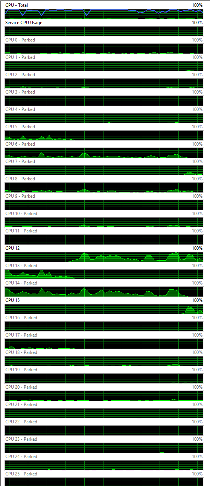
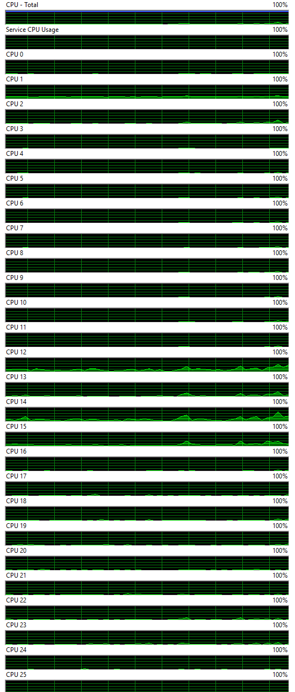

<div align="center">

# CPU Parking Disabler

**Kill micro-stutters. Keep all cores awake. One command.**

Disables CPU core parking and sets Energy Performance Preference to maximum on Windows 10/11.
Zero install. Zero dependencies. Just a PowerShell script.

[](LICENSE)
[](https://www.microsoft.com/windows)
[](https://docs.microsoft.com/en-us/powershell/)


</div>

---

## Quick Start

**One-liner** (run PowerShell as Admin):

```powershell
irm https://raw.githubusercontent.com/vadyaravadim/cpu-parking-disabler/main/cpu-parking-disabler.ps1 | iex
```

Or clone and run:

```powershell
git clone https://github.com/vadyaravadim/cpu-parking-disabler.git
cd cpu-parking-disabler
.\cpu-parking-disabler.ps1
```

No parameters, no configuration. Run and done.

## What It Does

1. **Backs up** your current power scheme to Desktop (`.pow` file)
2. **Disables CPU core parking** — all cores stay active, no wake-up latency
3. **Sets EPP to max performance** — CPU favors performance over power saving

That's it. No other settings are touched. Your current power scheme is modified in-place.

## Before & After

<!--
    Replace these with actual screenshots:
    1. Open Resource Monitor → CPU tab
    2. Take a screenshot BEFORE running the script (cores show "Parked")
    3. Run the script
    4. Take a screenshot AFTER (all cores show "Running")
    5. Save images to assets/ folder and update paths below
-->

| Before | After |
|--------|-------|
|  |  |

> Cores marked **Parked** → all cores **Running**. Open Resource Monitor → CPU tab to verify on your system.

## Settings Changed

| Setting | Description | Before | After |
|---------|-------------|--------|-------|
| `CPMINCORES` | Core Parking Min Cores (E-cores / all cores) | 10–50% | **100%** |
| `CPMINCORES1` | Core Parking Min Cores (P-cores, hybrid CPUs) | 10–50% | **100%** |
| `PERFEPP` | Energy Performance Preference (E-cores / all cores) | 50 | **0** |
| `PERFEPP1` | Energy Performance Preference (P-cores, hybrid CPUs) | 50 | **0** |

> `CPMINCORES1` and `PERFEPP1` are Class 1 (P-core) settings — they only exist on Intel 12th gen+ hybrid CPUs. The script unhides them via registry before applying values.

## The Problem

CPU core parking puts idle cores to sleep. When load spikes, waking cores takes **1–15 ms** — causing micro-stutters, frame drops, and input lag. This script keeps all cores active so they respond instantly.

**Symptoms this fixes:**
- Stuttering in games despite high FPS
- Input lag spikes
- Frame time inconsistency

## Verify

```powershell
powercfg -query SCHEME_CURRENT SUB_PROCESSOR CPMINCORES
powercfg -query SCHEME_CURRENT SUB_PROCESSOR PERFEPP
```

CPMINCORES should show `0x00000064` (100), PERFEPP should show `0x00000000` (0).

## Rollback

From backup (saved on Desktop):
```powershell
powercfg -import "$env:USERPROFILE\Desktop\power_scheme_backup_*.pow"
```

Full reset to Windows defaults:
```powershell
powercfg -restoredefaultschemes
```

## Side Effects

- **Higher idle power** (+10–30 W) — not recommended on battery
- **Higher temps** (+5–10 °C) — monitor with [HWiNFO64](https://www.hwinfo.com/), keep under 85 °C
- **More fan noise**

## Compatibility

| | Supported |
|---|-----------|
| **Intel** | 10th gen+ (12th+ for hybrid P/E-core support) |
| **AMD** | Ryzen 5000 / 7000 / 9000 |
| **Windows** | 10, 11 (23H2, 24H2) |

## License

[MIT](LICENSE) — use at your own risk.

---

<div align="center">

If this fixed your stutters, consider giving it a ⭐

[Report Issues](https://github.com/vadyaravadim/cpu-parking-disabler/issues)

</div>
