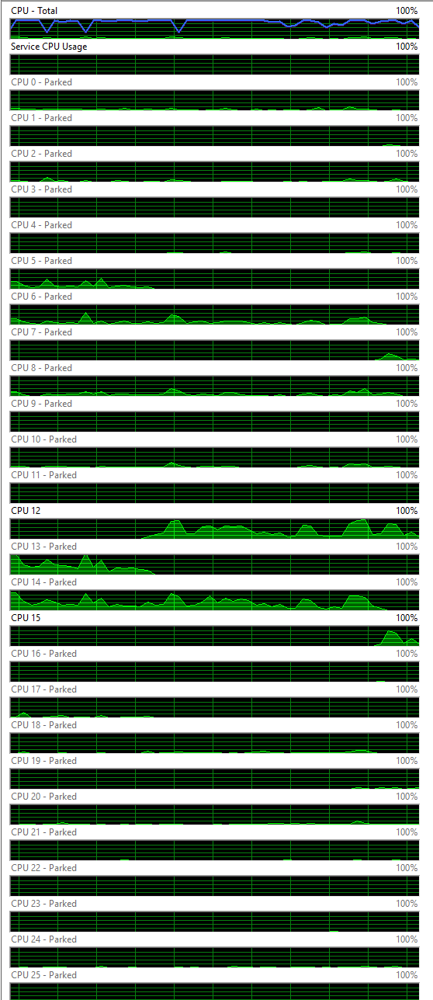
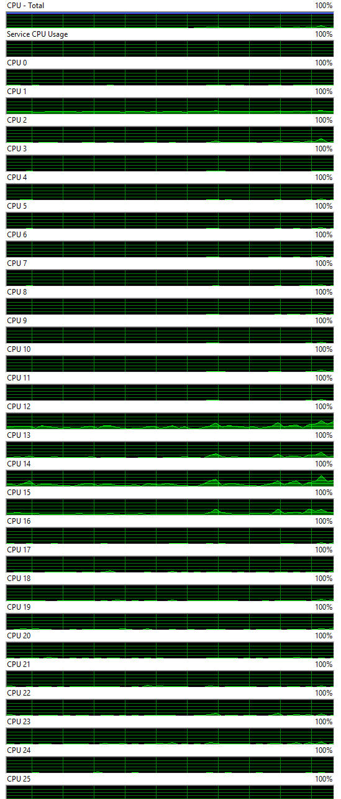

<div align="center">

# CPU Parking Disabler

**Kill micro-stutters. Unpark every core. One command.**

Disables CPU core parking (a.k.a. **unparking your CPU cores**) and sets Energy Performance Preference to maximum on Windows 10/11.
Zero install. Zero dependencies. Shows the parked-core count before and after. Built-in undo.

[](https://github.com/vadyaravadim/cpu-parking-disabler/actions/workflows/lint.yml)
[](LICENSE)
[](https://www.microsoft.com/windows)
[](https://docs.microsoft.com/en-us/powershell/)
[](https://github.com/vadyaravadim/cpu-parking-disabler/releases)
[](https://www.powershellgallery.com/packages/cpu-parking-disabler)


**[Read the deep dive with measured benchmarks →](https://rigpolice.com/system/articles/disable-cpu-core-parking/)**

</div>

---

## Quick Start

**Easiest — from the PowerShell Gallery:**

```powershell
Install-Script cpu-parking-disabler
cpu-parking-disabler                 # then run it by name (open a NEW PowerShell window first, so the Scripts folder is on PATH)
```

The script self-elevates. Update later with `Update-Script cpu-parking-disabler`.

**One-liner** instead (in any PowerShell — it self-elevates):

```powershell
irm https://raw.githubusercontent.com/vadyaravadim/cpu-parking-disabler/main/cpu-parking-disabler.ps1 | iex
```

The script saves itself to `%USERPROFILE%\cpu-parking-disabler.ps1` and reruns from there; an existing copy at that path that differs is kept as `.bak`. The undo file is written next to it.

**Or clone:**

```powershell
git clone https://github.com/vadyaravadim/cpu-parking-disabler.git
cd cpu-parking-disabler
.\cpu-parking-disabler.ps1
```

**Or download the ZIP** (no PowerShell needed): click **Code ▸ Download ZIP** at the top of this page, unzip, then double-click **`Run.bat`**.

Whichever method you use, click **Yes** on the UAC prompt — the script requests admin rights on its own, no need to open an admin console manually.

No parameters, no configuration. Run and done. Two optional switches:

| Switch | What it does |
|--------|--------------|
| `-Status` | Show how many cores are parked right now and the four settings behind it. Changes nothing, needs no admin rights. |
| `-Undo` | Put the values back the way they were before the last run. |

## What It Does

1. **Shows the current state** — parked cores out of total, and each setting's AC / DC value next to its target
2. **Writes an undo file** (`parking_undo_<stamp>.json`, next to the script) with the previous values, before anything changes
3. **Disables CPU core parking** (unparks all cores) — all cores stay active, no wake-up latency
4. **Sets EPP to max performance** — CPU favors performance over power saving
5. **Shows the parked-core count again** — the effect is on screen, not taken on trust

That's it. No other settings are touched. Your current power scheme is modified in-place, for both AC and battery. A second run on an already-tweaked machine changes nothing and writes no undo file.

```
CPU           : Intel(R) Core(TM) i9-14900F  (24 cores / 32 threads, hybrid P+E)
Power scheme  : High performance
Parked cores  : 24 of 32

  Setting        AC   DC Target
  CPMINCORES     25   25    100  -> (core parking min cores, E-cores / all cores)
  CPMINCORES1    25   25    100  -> (core parking min cores, P-cores)
  PERFEPP        50   50      0  -> (energy performance preference, E-cores / all cores)
  PERFEPP1       50   50      0  -> (energy performance preference, P-cores)

Undo file saved: C:\Users\you\cpu-parking-disabler\parking_undo_20260905_032754.json (revert with -Undo)

Applying...
  [OK ] CPMINCORES   AC  25 -> 100  DC  25 -> 100
  [OK ] CPMINCORES1  AC  25 -> 100  DC  25 -> 100
  [OK ] PERFEPP      AC  50 -> 0    DC  50 -> 0
  [OK ] PERFEPP1     AC  50 -> 0    DC  50 -> 0

Parked cores  : 24 of 32 -> 0 of 32
```

## Before & After

| Before | After |
|--------|-------|
|  |  |

> Cores marked **Parked** → all cores **Running**. Open Resource Monitor → CPU tab to verify on your system.

## Settings Changed

| Setting | Description | Before | After |
|---------|-------------|--------|-------|
| `CPMINCORES` | Core Parking Min Cores (E-cores / all cores) | 10–50% | **100%** |
| `CPMINCORES1` | Core Parking Min Cores (P-cores, hybrid CPUs) | 10–50% | **100%** |
| `PERFEPP` | Energy Performance Preference (E-cores / all cores) | 50 | **0** |
| `PERFEPP1` | Energy Performance Preference (P-cores, hybrid CPUs) | 50 | **0** |

> `CPMINCORES1` and `PERFEPP1` are Class 1 (P-core) settings — they only exist on Intel 12th gen+ hybrid CPUs. The script unhides all four via registry before applying values; they stay visible under Power Options → Processor power management afterwards, which is harmless.

## The Problem: Why Core Parking Causes Stutters

CPU core parking puts idle cores to sleep. When load spikes, waking cores takes **1–15 ms** — causing micro-stutters, frame drops, and input lag. This script keeps all cores active so they respond instantly.

**Symptoms this fixes:**
- Stuttering in games despite high FPS
- Input lag spikes
- Frame time inconsistency

## Measured Impact

Three states on an i9-14900F (8 P + 16 E cores, Windows 11 24H2): stock, parking forced (24 of 32 threads parked — the state aggressive-parking machines live in), and after this script:

| Metric | Stock | Parking active | After the script |
|--------|-------|----------------|------------------|
| 7-Zip rating, 32 threads | 175,111 MIPS | 71,120 MIPS (**−59%**) | 175,695 MIPS |
| Worst frame (144 Hz sim) | 6.5 ms | **17.3 ms** | 5.4 ms |
| Frames over the 6.9 ms budget | 0% | 0.14% | 0% |

Parking costs tail latency (micro-stutter), not average speed — and the script removes it even against hard parking caps. Full methodology, screenshots, and the "check your own PC in 30 seconds" guide: **[the RigPolice deep dive](https://rigpolice.com/system/articles/disable-cpu-core-parking/)**. Reproduce it yourself with [`bench/bench.ps1`](bench/bench.ps1) + `7zr b 3 -mmt32`.

## Verify: Check If Your CPU Cores Are Parked

```powershell
.\cpu-parking-disabler.ps1 -Status
```

Prints the parked-core count and the four settings without changing anything (no admin prompt). Or open **Resource Monitor** (`resmon`) → **CPU** tab: parked cores are labeled **Parked** next to the core graph; after running the script every core should say **Running**.

## Rollback

```powershell
.\cpu-parking-disabler.ps1 -Undo
```

Restores the values recorded in the newest `parking_undo_*.json` next to the script, to the power scheme they came from, and renames the file to `.applied.json`. Undo files are per-run snapshots: after several runs, run `-Undo` once per run, newest to oldest — only the oldest holds the original state.

**Full reset to Windows defaults** — simplest, but resets *all* power schemes:
```powershell
powercfg -restoredefaultschemes
```

## Side Effects

- **Higher idle power** (+10–30 W) — not recommended on battery
- **Higher temps** (+5–10 °C) — monitor with [HWiNFO64](https://www.hwinfo.com/), keep under 85 °C
- **More fan noise**

## Compatibility

| | Supported |
|---|-----------|
| **Intel** | 10th gen+ (12th+ for hybrid P/E-core support) |
| **AMD** | Ryzen 5000 / 7000 / 9000 — **not recommended on dual-CCD X3D parts**, see below |
| **Windows** | 10, 11 (23H2, 24H2), any display language |

> **Ryzen 9 7900X3D / 7950X3D / 9900X3D / 9950X3D:** AMD's 3D V-Cache Performance Optimizer parks the non-V-Cache CCD during games *through core parking*, on purpose, so the game stays on the cache CCD. Unparking every core defeats that and games can run worse. The script detects these CPUs and asks before continuing. Single-CCD X3D parts (7800X3D, 9800X3D) are unaffected.

## FAQ

### What is CPU core parking?
A Windows power-management feature that puts idle CPU cores into a low-power **parked** state. Waking a parked core takes ~1–15 ms, which can cause micro-stutters, frame-time spikes, and input lag under bursty load.

### What does "unpark CPU cores" mean?
Unparking means forcing Windows to keep every core active instead of parking idle ones. This script **unparks all CPU cores** by setting Core Parking Min Cores to 100%.

### Does disabling core parking increase FPS?
It mainly improves **1% lows, frame-time consistency, and input latency** — not average FPS. If your stutter comes from core wake-up latency, unparking helps; if your CPU never parks under load, you won't notice a difference.

### Is it safe to unpark CPU cores?
Yes. It only changes power settings and writes an undo file first, so you can always roll back with `-Undo`. The trade-offs are higher idle power and temperatures (see [Side Effects](#side-effects)), not hardware risk — keep temps under ~85 °C.

### Do the changes survive a reboot?
Yes. The values are written into your active Windows power scheme, so they persist across reboots until you roll back (or a major Windows update resets power schemes).

### How do I check if my CPU cores are parked?
Run the script with `-Status`, or open **Resource Monitor** (Win+R → `resmon`) → **CPU** tab: parked cores are labeled **Parked**. See [Verify](#verify-check-if-your-cpu-cores-are-parked).

### I have a 7950X3D / 9950X3D — should I run this?
Probably not. On dual-CCD X3D chips AMD *uses* core parking to keep games on the V-Cache CCD; unparking everything lets threads land on the other CCD and costs performance in games. See [Compatibility](#compatibility). If you have a specific reason (a workload that scales across both CCDs), the script asks for confirmation and `-Undo` puts it back.

### How is this different from ParkControl (Bitsum)?
ParkControl is a GUI app. This is a zero-install, open-source PowerShell script that applies the same core-parking + EPP tweak directly via `powercfg`/registry, writes an undo file, and leaves **no background process** behind. Use whichever you prefer — this is the lightweight, transparent, scriptable option.

### How is this different from Quick CPU?
Quick CPU (Coder Bag) is a closed-source GUI app for monitoring and tuning many CPU parameters, core parking among them. This script does one thing — unpark all cores and max out EPP — with no install, no background process, and readable source. If you only want core parking gone, this is the smaller hammer.

### Can I disable core parking through the registry (ValueMax method)?
Registry guides that tell you to search for `0cc5b647-c1df-4637-891a-dec35c318583` and edit `ValueMax`/`Attributes` are manipulating the same **Core Parking Min Cores** setting this script changes. `powercfg` is the documented interface for it — same result, no manual registry surgery, plus an undo file.

### How do I re-enable core parking?
Run the script with `-Undo` — see [Rollback](#rollback).

## Related

- [MSI Mode Utility](https://github.com/vadyaravadim/msi-mode-utility) — enable MSI mode (Message Signaled Interrupts) for GPU, USB, network & audio devices to cut DPC latency and input lag
- [Interrupt Affinity Utility](https://github.com/vadyaravadim/interrupt-affinity-utility) — pin GPU, network, USB & audio interrupts to specific CPU cores (P/E-core aware) to tame DPC latency
- [Timer Resolution Utility](https://github.com/vadyaravadim/timer-resolution-utility) — set 0.5 ms timer resolution, disable dynamic tick, un-force HPET — with a built-in Sleep(1) benchmark
- [GameDVR & FSO Disabler](https://github.com/vadyaravadim/gamedvr-fso-disabler) — disable Game DVR / Xbox Game Bar capture and Fullscreen Optimizations on Windows 10/11 to fix capture stutters and frame drops
- [Remove Hidden Devices](https://github.com/vadyaravadim/remove-hidden-devices) — remove ghost / hidden devices left behind by unplugged USB sticks, headsets & dongles cluttering Device Manager

Same idea across the series: one transparent PowerShell script, no binaries, you see exactly what changes.

## License

[MIT](LICENSE) — use at your own risk.

---

<div align="center">

If this fixed your stutters, consider giving it a ⭐

[Report Issues](https://github.com/vadyaravadim/cpu-parking-disabler/issues)

</div>
